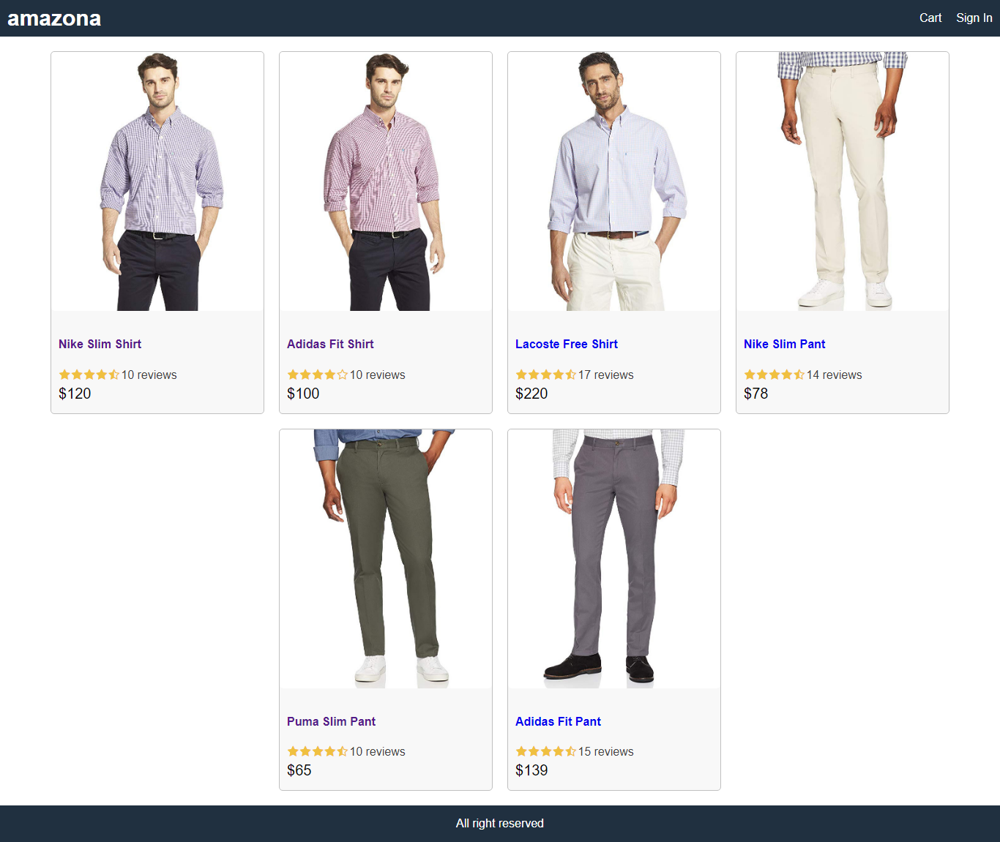
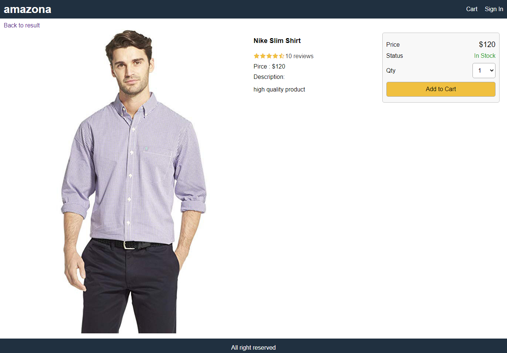
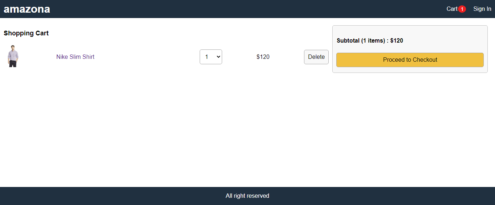
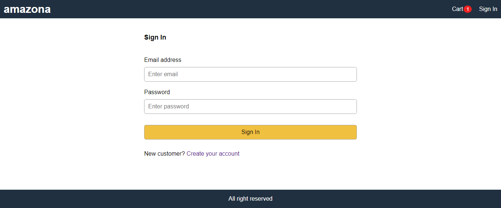
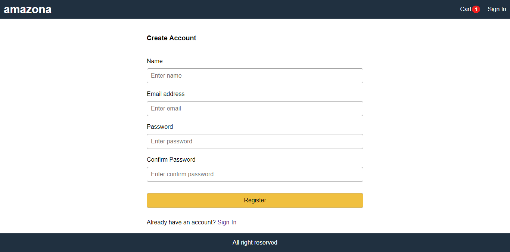
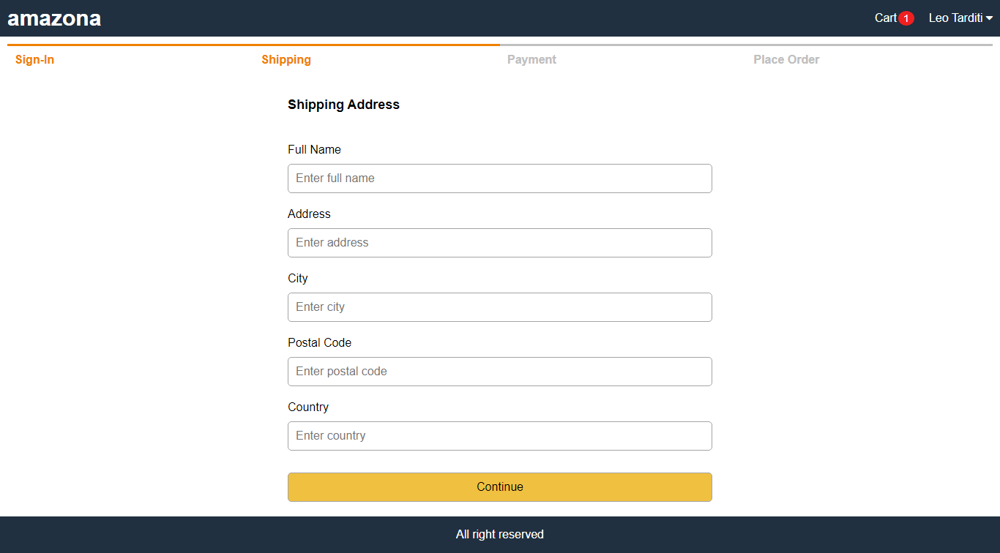
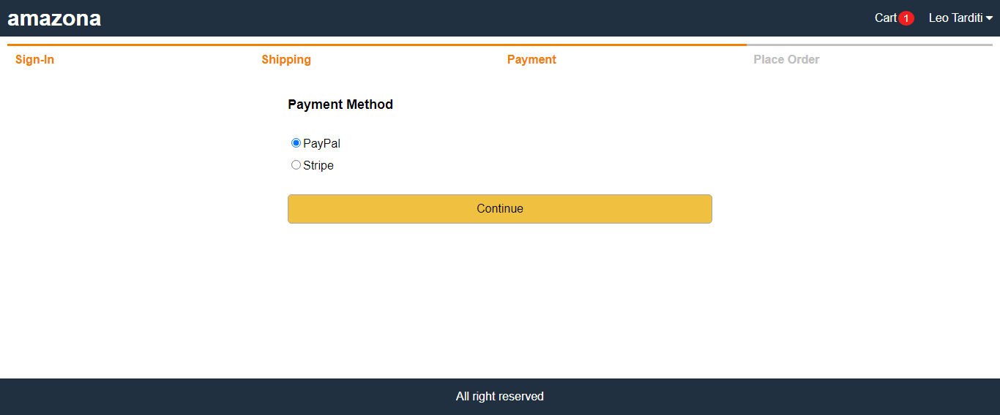
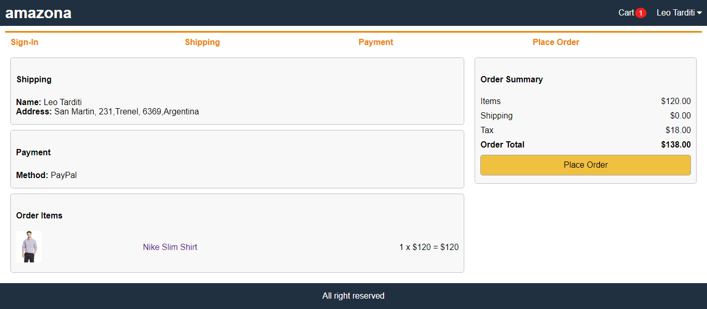
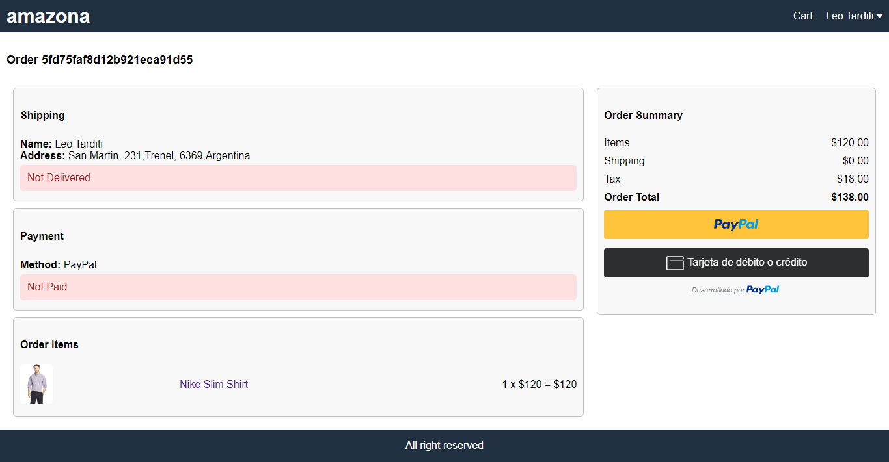

# Amazona ECommerce Website










## Run Locally

### 1. Setup MongoDB

- Local MongoDB
  - Install it from [here](https://www.mongodb.com/try/download/community)
  - Create .env file in root folder
  - Set MONGODB_URL=mongodb://localhost/amazona  
- Atlas Cloud MongoDB
  - Create database at [https://cloud.mongodb.com](https://cloud.mongodb.com)
  - Create .env file in root folder
  - Set MONGODB_URL=mongodb+srv://your-db-connection

### 2. Run Backend

```
$ npm install
$ npm start
```

### 3. Run Frontend

```
# open new terminal
$ cd frontend
$ npm install
$ npm start
```

### 4. Seed Users and Products

- Run this on chrome: http://localhost:5000/api/users/seed
- It returns admin email and password
- Run this on chrome: http://localhost:5000/api/products/seed
- It creates 6 sample products